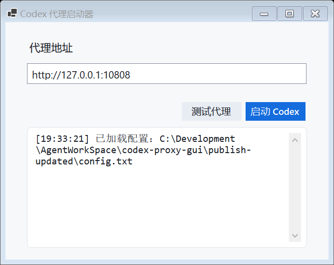

# Codex Proxy Launcher

A small Windows GUI launcher for starting the Codex desktop app with proxy
environment variables.

The launcher is useful when Codex needs to access the network through a local
HTTP or SOCKS proxy, especially on Windows setups where proxy settings are not
automatically inherited by every process that Codex starts.



## Features

- Simple Windows Forms interface for editing the primary proxy address.
- Starts the Codex app with `HTTP_PROXY`, `HTTPS_PROXY`, `ALL_PROXY`, `NO_PROXY`,
  and related proxy environment variables.
- Supports HTTP and SOCKS proxy URLs such as `http://127.0.0.1:10808` and
  `socks5://127.0.0.1:10808`.
- Can detect Codex's WSL backend setting and optionally pass proxy variables
  into WSL through `WSLENV`.
- Writes append-only runtime logs to `log.txt` next to the executable.
- Ships as a self-contained Windows executable.

## Requirements

- Windows 10 or later.
- .NET 9 SDK, only required when building from source.
- Codex desktop app installed on the machine.

## Quick Start

1. Download or build `CodexProxyLauncher.exe`.
2. Put `config.txt` next to the executable, or let the launcher create it on
   first run.
3. Run `CodexProxyLauncher.exe`.
4. Enter your proxy address, for example:

   ```text
   http://127.0.0.1:10808
   ```

   or:

   ```text
   socks5://127.0.0.1:10808
   ```

5. Click **启动 Codex**.

If Codex is already running, the launcher will ask you to close it first. It
does not kill existing Codex processes automatically.

## Configuration

Settings are stored in `config.txt` next to the executable. The GUI edits only
`proxy_address`; advanced options can be changed by editing the file directly.

```ini
proxy_address=http://127.0.0.1:10808
chromium_proxy=
no_proxy=localhost,127.0.0.1,::1
codex_exe_path=
startup_wait_seconds=20
temporarily_set_user_proxy_environment=false
enable_wsl_proxy=false
```

### Options

- `proxy_address`: Main proxy URL passed to Codex. Include the scheme, such as
  `http://` or `socks5://`.
- `chromium_proxy`: Optional Chromium-specific proxy override. Leave empty to
  reuse `proxy_address`.
- `no_proxy`: Comma-separated hosts that should bypass the proxy.
- `codex_exe_path`: Optional explicit path to `Codex.exe`. Leave empty to let
  the launcher auto-detect Codex.
- `startup_wait_seconds`: How long to wait for Codex to appear after launch.
- `temporarily_set_user_proxy_environment`: Temporarily writes proxy variables
  to the current user's environment when launching packaged Windows app entries.
- `enable_wsl_proxy`: Enables WSL proxy propagation. It is disabled by default.

## WSL Proxy Support

When `enable_wsl_proxy=true`, the launcher checks:

```text
%USERPROFILE%\.codex\config.toml
```

If it finds:

```toml
runCodexInWindowsSubsystemForLinux = true
```

the launcher adds proxy variables to `WSLENV` and attempts to configure proxy
settings inside WSL. If the WSL proxy endpoint cannot be reached, the launcher
will continue starting Codex and show a warning because network requests may
hang inside the WSL backend.

## Logs

Runtime logs are appended to:

```text
log.txt
```

The file is stored in the same directory as `CodexProxyLauncher.exe`. It is not
cleared between launches.

## Build

From the project directory:

```powershell
dotnet publish .\CodexProxyLauncher.Gui.csproj -c Release -r win-x64 --self-contained true -p:PublishSingleFile=true -o .\publish
```

The generated executable will be:

```text
publish\CodexProxyLauncher.exe
```

## Repository Layout

```text
.
├── Program.cs
├── CodexProxyLauncher.Gui.csproj
├── config.txt
├── log.txt
├── assets/
│   ├── app-icon.ico
│   └── app-icon.png
└── app.manifest
```

## License

This project is licensed under the MIT License. See [LICENSE](LICENSE).
